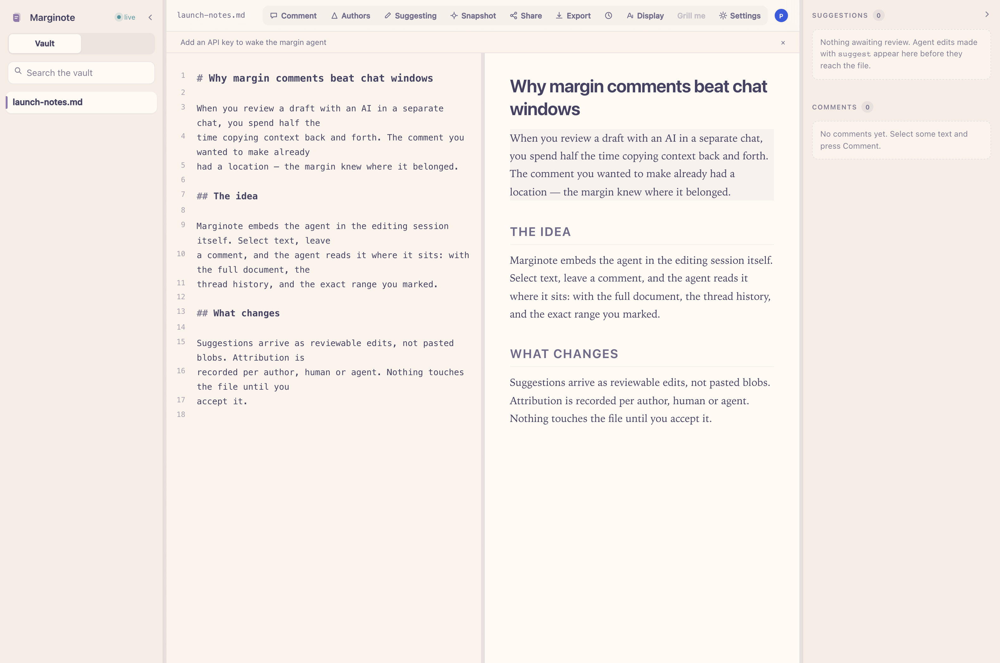

# Marginote

[](https://github.com/jxtse/marginote/actions/workflows/ci.yml)
[](https://nodejs.org/)
[](./LICENSE)

**Local-first collaborative Markdown, HTML and LaTeX, with an agent in the margin.**

Write in Markdown, HTML or LaTeX, collaborate live, and ask for help where the words are.
Select text, leave a comment, and the embedded agent reads it immediately — with the
full document, the thread history, and the exact range you marked. It answers on the
thread, proposes reviewable edits that never touch the file until you accept them,
and grills finished drafts with findings anchored to the exact sentences they concern.
No separate chat window, no copying context back and forth.



Marginote is a fork of [Quire](https://github.com/heetdalsania/quire) by Heet Dalsania
(AGPL-3.0); the collaborative core is his work. Marginote adds the embedded agent,
the source↔preview navigation layer, and the Grill me review.

## Quick start

Requires **Node.js 22 or newer**.

```bash
npx marginote
```

1. Open the local URL printed in the terminal (default `http://127.0.0.1:4321`).
   Your vault is `~/Documents/Marginote`; the first launch creates that folder and a
   friendly `welcome.md`. An existing folder is never re-seeded.
2. Open **Settings**. Add your OpenAI-compatible provider's Base URL, API key, and
   model id. **Save & test connection** checks a real one-token completion.
3. Select text → leave a comment → watch the margin answer. Reply to keep talking.
4. Click **Grill me** when your draft is ready for a tougher read.

No account or signup. Core editing works without a key. Press `Ctrl+C` to stop.

## What you get

- **Source↔preview navigation:** double-click the rendered text to jump to its source;
  cursor follow keeps the preview aligned without stealing focus.
- **Comment-triggered agent:** human comments start a run; replies continue the thread.
  Runs share a per-document queue, so a grill and a comment never execute concurrently
  on the same document. Different documents can run independently.
- **Grill me:** a claim-tree review of unsupported claims, logic gaps, structure,
  confusion, ignored counterarguments, and checkable facts. Up to eight exact-text
  findings recommend fixes; a separate title-anchored summary names the biggest
  weakness, biggest strength, and first three fixes. Push back by replying in place.
- **Suggest-mode edits with attribution:** proposed changes wait for human acceptance;
  they do not rewrite the Markdown on disk behind your back. Locks and budgets apply.
- **The Quire collaborative core:** live CRDT collaboration, visible presence, comments,
  provenance, plain git-friendly files, preview, document history and optional git
  snapshots. No required cloud storage, import step, or proprietary document format.

## Your files, your provider

The filesystem remains the source of truth. Point Marginote at a Markdown/HTML folder or LaTeX project:

```bash
marginote ~/my-notes
# Or without a global installation:
npx marginote ~/my-notes
```

Keys stay in `<vault>/.marginote/agent.json` with owner-only permissions, are masked in
API responses, and never enter document text. Agent settings and grilling are
loopback-only. Keep `.marginote/` out of version control and shared backups.

**Local-first does not mean an enabled agent is offline:** document context and selected
images go to your configured model provider. Search queries go to DuckDuckGo, or to
Tavily/Exa when configured. Core editing requires no provider. Discover and peer setup
may contact external services when used. The embedded agent has no shell or arbitrary
filesystem tools; page fetching rejects private-network destinations. Runs time out
after three minutes, and failures surface in agent status/Settings.

## Advanced usage

HTML (`.html`, `.htm`) reports retain their local styles and scripts in an isolated
preview. Select rendered text to discuss it, navigate between source and preview, and
export the original HTML. See [HTML artifacts](docs/html-artifacts.md) for supported
assets, dynamic-content boundaries and validation.

**Development preview:** this checkout can attach an exact Codex, Claude Code or Hermes delivery boundary and
continue a native fork through document comments. Its originating conversation history
stays with the document discussion. See [artifact conversations](docs/artifact-conversations.md)
and the repository [plugin](plugins/marginote/skills/artifact-review/SKILL.md). The standalone
pi agent remains available. Attached native editing tools propose version-checked changes
for human acceptance. The Claude adapter has native fork and protocol checks, but its
live-model workflow remains unverified. Hermes now has a native continuation adapter,
verified with an isolated local model fixture, including editing and one-time permission
denial. See its [native plugin setup](plugins/marginote-hermes/README.md).
Real-model validation across all adapters and enforced native edit routing remain unfinished.

LaTeX (`.tex`) has Tectonic PDF preview with main-document selection, automatic
dependency refresh, retained page/zoom, line-level source navigation, completion,
compiler diagnostics and an offline setup check; Markdown
supports relative vault images and PDF figure links. See [LaTeX and image setup](docs/latex-and-images.md)
for the offline cache and OS sandbox prerequisites, security limits, and verification commands.

```bash
npx marginote --demo                 # Disposable sample vault, removed on shutdown
npx marginote ~/notes --port 4322     # Choose a port
npx marginote ~/notes --git          # Opt in to periodic git snapshots
npx marginote --help                 # All flags, including host, discovery and history
```

The default bind address is `127.0.0.1`. Deliberate network sharing requires explicit
host configuration; see [SECURITY.md](SECURITY.md). `--no-discover` disables discovery
traffic, not an agent you explicitly configure. `--no-persist` makes collaboration
metadata temporary; document edits still save to disk. `--allow-exec` explicitly
enables local fenced-code execution and is separate from the embedded agent sandbox.

One Marginote runtime owns each vault, including `--no-persist` sessions. Reuse its
existing URL rather than launching a second server for another document. Normal shutdown
releases ownership; after a crash, allow up to two minutes before restarting.

External MCP collaborators can still join through `marginote-mcp`; the embedded agent
needs no separate MCP client. See [docs/](docs/) for the inherited workflows and details.

## Develop locally

```bash
npm install
npm run build
node packages/cli/bin/marginote.js --demo
npm run typecheck
npm test
npx playwright test --project=chromium
```

`npm run build:release` stages the distributable CLI and web assets;
`npm run check:release` checks that package. [CHANGELOG.md](CHANGELOG.md) retains the
upstream history beneath the Marginote additions.

## Acknowledgements and license

- Heet Dalsania and the Quire contributors built the collaborative core.
- The grill prompt is adapted from Matt Pocock's MIT-licensed
  [`grilling` skill](https://github.com/mattpocock/skills).
- Marginote maintainer: [jxtse](https://github.com/jxtse).

Marginote remains **AGPL-3.0-or-later**. See [LICENSE](LICENSE).
