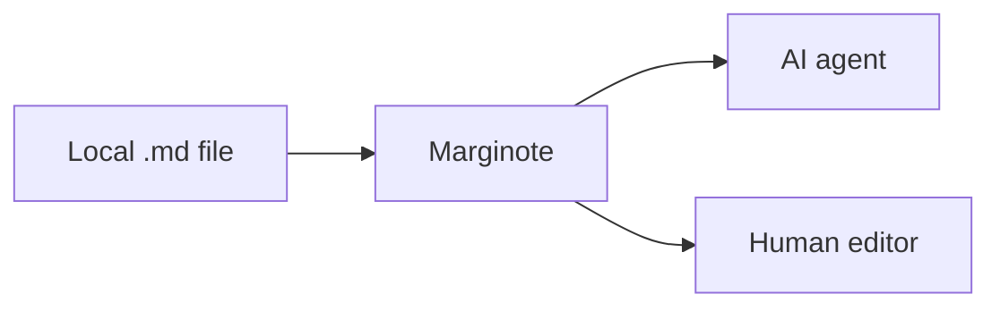

# Markdown Round-trip Fixture

<!-- This comment must survive byte-for-byte. -->

This fixture includes **bold**, *italic*, ~~strikethrough~~, `inline code`, an
[external link](https://example.com/docs?q=markdown), and a [[Wiki Link]].

> [!NOTE]
> Extended Markdown should remain source text, even when a renderer does not understand it.

## Work items

- [x] Preserve completed tasks
- [ ] Preserve open tasks
  - Preserve nested list indentation

| Feature | Expected result |
| --- | --- |
| Frontmatter | Preserved |
| Fenced code | Preserved |
| Mermaid | Preserved |

```ts
const message = "Do not rewrite <tags> or & entities";
console.log(message);
```



A footnote reference stays attached.[^source]

[^source]: Footnote text with a relative link to [the guide](../guide.md).

<details>
<summary>Raw HTML</summary>

The blank lines and tags in this block are intentional.

</details>

Escaped punctuation: \*literal asterisks\* and `two  spaces`.

